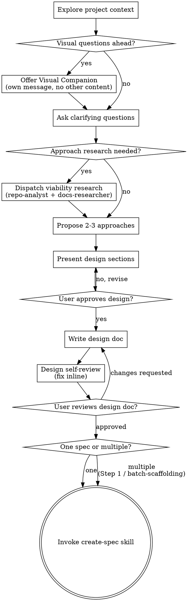

# Brainstorming Ideas Into Designs

Help turn ideas into fully formed designs and specs through natural collaborative dialogue.

## Prerequisites

Apply [references/dependency-preflight.md](references/dependency-preflight.md)
before the checklist. Run all checks and present a consolidated report.

| Dependency | Type | Purpose |
|------------|------|---------|
| `git` | Required | Project context exploration, design doc commits |
| `cursor-ide-browser` MCP | Optional | Visual companion for mockups and diagrams |

If `git` is missing, stop. If `cursor-ide-browser` MCP is unavailable, skip
the visual companion offer and proceed with text-only brainstorming — do not
offer a feature that cannot work.

## Optional user profile

Apply [references/user-profile.md](references/user-profile.md) before the checklist.
- Mode governs interaction cadence during design dialogue. Does not change design steps or checklist order.
- `[CHECK]` visual companion, viability research, approach selection, design section approval, decomposition nudge. `[SIGNAL]` prior learnings. `[NOTE]` design doc commit. `[GATE]` design approval, design doc review, create-spec transition.

Start by understanding the current project context, then ask questions one at a time to refine the idea. Once you understand what you're building, present the design and get user approval.

 
Do NOT invoke any implementation skill, write any code, scaffold any project, or take any implementation action until you have presented a design and the user has approved it. This applies to EVERY project regardless of perceived simplicity.
 

## Anti-Pattern: "This Is Too Simple To Need A Design"

Every project goes through this process. A todo list, a single-function utility, a config change — all of them. "Simple" projects are where unexamined assumptions cause the most wasted work. The design can be short (a few sentences for truly simple projects), but you MUST present it and get approval.

## Checklist

You MUST create a task for each of these items and complete them in order:

1. **Explore project context** — check files, docs, recent commits, prior learnings
2. `[CHECK]` **Offer visual companion** (if topic will involve visual questions) — this is its own message, not combined with a clarifying question. See the Visual Companion section below.
3. **Ask clarifying questions** — one at a time, understand purpose/constraints/success criteria
4. `[CHECK]` **Approach viability research** — dispatch `repo-analyst` and `docs-researcher` to validate feasibility before proposing approaches. Skip if context from step 1 is sufficient. See Approach Viability Research below.
5. `[CHECK]` **Propose 2-3 approaches** — with trade-offs and your recommendation; each approach references at least one research finding
6. **Present design** — `[CHECK]` per section, `[GATE]` final approval — in sections scaled to their complexity
7. `[NOTE]` **Write design doc** — save to `docs/designs/YYYY-MM-DD-<topic>-design.md` and commit
8. **Design self-review** — quick inline check for placeholders, contradictions, ambiguity, scope (see below)
9. `[GATE]` **User reviews written design doc** — ask user to review the design doc before proceeding
10. `[CHECK]` **Decomposition nudge** — reason about whether the approved design should seed one spec or multiple; produce a one-sentence rationale and, when multiple, a lightweight `title + one-sentence outcome` line per candidate. See Decomposition Nudge below.
11. `[GATE]` **Transition to implementation** — invoke `create-spec` skill to formalize the approved design (or route a multi-spec backlog into `create-spec` Step 1 / batch-scaffolding)

## Process Flow

**The terminal state is invoking `create-spec`.** Do NOT invoke `agent-coding` or any other implementation skill. The ONLY skill you invoke after brainstorming is `create-spec`.

## The Process

**Understanding the idea:**

- Check out the current project state first (files, docs, recent commits)
- `[SIGNAL]` — Consult `.spec/_ledger/` and recent completed specs for prior learnings relevant to the topic being brainstormed
- Before asking detailed questions, assess scope: if the request describes multiple independent subsystems (e.g., "build a platform with chat, file storage, billing, and analytics"), flag this immediately. Don't spend questions refining details of a project that needs to be decomposed first.
- If the project is too large for a single spec, help the user decompose into sub-projects: what are the independent pieces, how do they relate, what order should they be built? Then brainstorm the first sub-project through the normal design flow. Each sub-project gets its own spec → plan → implementation cycle.
- For appropriately-scoped projects, ask questions one at a time to refine the idea
- Prefer multiple choice questions when possible, but open-ended is fine too
- Only one question per message - if a topic needs more exploration, break it into multiple questions
- Focus on understanding: purpose, constraints, success criteria

**Approach viability research:**

Before proposing approaches, assess whether targeted research would improve proposal quality.

- `[CHECK]` — **Skip when:** the repo is greenfield, scope is trivial, or step 1 already surfaced the patterns, libraries, and constraints that would shape approaches. When skipping, state in one or two sentences what you would have checked (e.g., "existing caching patterns," "framework support for X") and why you expect no new signal.
- **Investigate when:** the codebase has existing patterns, libraries, or architectural constraints that could validate or rule out candidate approaches. Read `research_subagents` from [`references/user-profile.md`](references/user-profile.md) (absent or malformed → `true`) to pick the path:
  - `research_subagents: true` — send two parallel Task calls in a single message with `model: fast` and `readonly: true`:
    - `subagent_type: repo-analyst` — brief: topic summary, constraints from Q&A, ask what existing patterns, abstractions, or conventions support or constrain candidate approaches
    - `subagent_type: docs-researcher` — brief: topic summary, stack/framework context, ask what framework capabilities, library APIs, or documented limitations affect feasibility
  - `research_subagents: false` — the main agent performs both investigations itself in a single pass, using the same two briefs as mental checklists and producing the same lane-attributed evidence shape (repo patterns first, then docs lookup) for the synthesis bullet below.
- Keep each brief under 200 words. Briefs must be self-contained (subagents start with clean context). The same 200-word bound applies to the inline path's per-lane evidence summary.
- When a dispatched lane returns empty or whitespace-only output from `Await`, apply [references/subagent-dispatch.md](references/subagent-dispatch.md) to recover its final message from the transcript before treating the lane as failed. A salvaged lane feeds synthesis with its attribution suffixed `(salvaged from transcript)` and counts as a successful lane for the gap check below. Salvage does not apply to the inline path.
- Synthesize findings and feed them into approach proposals — do not create a separate "Research Results" section.
- If a lane is unavailable or returns no useful signal, note the gap and proceed with available context. This applies whether the lane failed under dispatch or was being run inline by preference.

**Exploring approaches:**

- `[CHECK]` — Propose 2-3 different approaches with trade-offs
- Each approach references at least one finding from the viability research (e.g., "existing pattern X supports this" or "library Y does not support Z")
- Present options conversationally with your recommendation and reasoning
- Lead with your recommended option and explain why
- **Recommendation criteria:** Recommend the approach that best solves the problem given the constraints discovered during research — not the lowest-effort option. Name 2-3 criteria drawn from the problem constraints (e.g., fit to requirements, risk, maintainability) and evaluate approaches against them. Treat effort as one criterion among several, never the implicit tie-breaker.
- **No fabricated estimates:** Describe effort differences qualitatively ("simpler," "more involved," "fewer moving parts") — never with calendar or hour estimates ("~2 hours," "~1 day"). Agents cannot reliably estimate wall-clock time.
- **Cross-modal consistency:** The recommended approach must be the same in text discussion and any visual artifacts (mockups, diagrams). If visual exploration changes which approach you recommend, state the change and your reasoning explicitly before proceeding.

**Presenting the design:**

- Once you believe you understand what you're building, present the design
- Scale each section to its complexity: a few sentences if straightforward, up to 200-300 words if nuanced
- `[CHECK]` — Ask after each section whether it looks right so far
- Cover: architecture, components, data flow, error handling, testing
- Be ready to go back and clarify if something doesn't make sense
- `[GATE]` — After all sections are presented, get explicit approval of the complete design before writing the design doc

**Design for isolation and clarity:**

- Break the system into smaller units that each have one clear purpose, communicate through well-defined interfaces, and can be understood and tested independently
- For each unit, you should be able to answer: what does it do, how do you use it, and what does it depend on?
- Can someone understand what a unit does without reading its internals? Can you change the internals without breaking consumers? If not, the boundaries need work.
- Smaller, well-bounded units are also easier for you to work with - you reason better about code you can hold in context at once, and your edits are more reliable when files are focused. When a file grows large, that's often a signal that it's doing too much.

**Working in existing codebases:**

- Explore the current structure before proposing changes. Follow existing patterns.
- Where existing code has problems that affect the work (e.g., a file that's grown too large, unclear boundaries, tangled responsibilities), include targeted improvements as part of the design - the way a good developer improves code they're working in.
- Don't propose unrelated refactoring. Stay focused on what serves the current goal.

## After the Design

**Documentation:**

- `[NOTE]` — Write the validated design to `docs/designs/YYYY-MM-DD-<topic>-design.md`
  - (User preferences for design doc location override this default)
- Commit using the unscoped format `docs: <topic> design document` ([Git operations](references/lifecycle.md#git-operations)) since no spec ID exists during brainstorming

**Design Self-Review:**
After writing the design document, look at it with fresh eyes:

1. **Placeholder scan:** Any "TBD", "TODO", incomplete sections, or vague requirements? Fix them.
2. **Internal consistency:** Do any sections contradict each other? Does the architecture match the feature descriptions?
3. **Scope check:** Is this focused enough for a single implementation plan, or does it need decomposition?
4. **Ambiguity check:** Could any requirement be interpreted two different ways? If so, pick one and make it explicit.

Fix any issues inline. No need to re-review — just fix and move on.

**User Review Gate:**
`[GATE]` — After the design review loop passes, ask the user to review the written design doc before proceeding:

> "Design doc written and committed to `<path>`. Please review it and let me know if you want to make any changes before we proceed to creating a spec."

Wait for the user's response. If they request changes, make them and re-run the design review loop. Only proceed once the user approves.

**Decomposition nudge:**

After the user approves the design doc and before invoking `create-spec`, reason about whether this design should seed one spec or multiple. Produce a one-sentence rationale either way; when the conclusion is "multiple," also produce a lightweight `title + one-sentence outcome` line per candidate spec.

- `[CHECK]` — **Short-circuit when:** Q&A scoped the design to a single deliverable and the Design Self-Review scope check already confirmed it. State the one-sentence rationale and proceed directly to the Implementation `[GATE]` below.
- **Do not prescribe a decomposition method.** No INVEST checklist, no vertical/horizontal slicing rule, no dependency graph, no minimum or maximum spec count. Ask yourself to reason about fit — not to follow a framework.
- **Keep "one spec" a legitimate common answer.** Do not bias toward splitting; bad splits reintroduce dependencies and fragment coherent work.
- **On "multiple," hand off, don't duplicate.** Carry the backlog into the Implementation `[GATE]` below. [`create-spec` Step 1](../create-spec/SKILL.md) and [`create-spec/references/batch-scaffolding.md`](../create-spec/references/batch-scaffolding.md) own backlog sequencing, `depends_on` wiring, `planning-*` branch creation, and draft scaffolding. Do not invent a parallel flow here.

**Implementation:**

- `[GATE]` — Invoke the `create-spec` skill to formalize the approved design into a spec with acceptance criteria, research gate, and implementation guidance
  - Carry the design doc path (e.g., `docs/designs/YYYY-MM-DD-<topic>-design.md`) and any companion artifact paths into the spec's Implementation guidance under "Files likely affected" or a "Design references" sub-section, so agent-coding Step 4 can discover them automatically.
  - When the decomposition nudge concluded "multiple," carry the candidate backlog (title + one-sentence outcome per candidate) into `create-spec` so Step 1's decomposition `[CHECK]` picks it up.
- Do NOT invoke any other skill. `create-spec` is the next step.

## Key Principles

- **One question at a time** - Don't overwhelm with multiple questions
- **Multiple choice preferred** - Easier to answer than open-ended when possible
- **YAGNI ruthlessly** - Remove unnecessary features from all designs
- **Explore alternatives** - Always propose 2-3 approaches before settling
- **Incremental validation** - Present design, get approval before moving on
- **Be flexible** - Go back and clarify when something doesn't make sense

## Visual Companion

A browser-based companion for showing mockups, diagrams, and visual options during brainstorming. Available as a tool — not a mode. Accepting the companion means it's available for questions that benefit from visual treatment; it does NOT mean every question goes through the browser.

**Offering the companion:** When you anticipate that upcoming questions will involve visual content (mockups, layouts, diagrams), offer it once for consent:
> "Some of what we're working on might be easier to explain if I can show it to you in a web browser. I can put together mockups, diagrams, comparisons, and other visuals as we go. This feature is still new and can be token-intensive. Want to try it?"

**This offer MUST be its own message.** Do not combine it with clarifying questions, context summaries, or any other content. The message should contain ONLY the offer above and nothing else. Wait for the user's response before continuing. If they decline, proceed with text-only brainstorming.

**Per-question decision:** Even after the user accepts, decide FOR EACH QUESTION whether to use the browser or the chat. The test: **would the user understand this better by seeing it than reading it?**

- **Use the browser** for content that IS visual — mockups, wireframes, layout comparisons, architecture diagrams, side-by-side visual designs
- **Use the chat** for content that is text — requirements questions, conceptual choices, tradeoff lists, A/B/C/D text options, scope decisions

A question about a UI topic is not automatically a visual question. "What does personality mean in this context?" is a conceptual question — use the chat. "Which wizard layout works better?" is a visual question — use the browser.

If they agree to the companion, read the detailed guide before proceeding:
[references/visual-companion.md](references/visual-companion.md)
